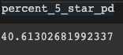

# Amazon Vine Analysis

## Overview

Consumer reviews are a critical factor for many businesses looking to improve their products and services.  Many companies rely on programs like Amazon Vine to get those reviews for their products and services.  In this analysis, we will be reviewing customer reviews, based on the amount of reviews that were submitted by Amazon Vine Members, and those submitted by non-members.  Because the Amazon Vine Members operate under a service that requires a review, analyzing the quality of the reviews between Amazon Vine Members and non-members will provide import insights into the reliability of consumer products and services.

## Resources

### Software
- Google Colabratory
- Amazon Web Services
- pgAdmin

### Languages
- Python
  - pySpark
- SQL

### Data Source

US Reviews Dataset- Home Entertainment
- https://s3.amazonaws.com/amazon-reviews-pds/tsv/index.txt
  - https://s3.amazonaws.com/amazon-reviews-pds/tsv/amazon_reviews_us_Home_Entertainment_v1_00.tsv.gz

## Results

In conducting this analysis, we selected Home Entertainment review data from Amazon US reviews dataset.  We were able to create a new dataset from this data, that provided specific information on how many reviews in the Home Entertainment dataset were Vine members, and how many were not vine members.  We selected specific criteria through filtering to help determine a dataset that would give the most accurate results.

### Filtering Results

In order to produce a set of reliable results, we began with filtering the data twice: we wanted only results where the total_votes per review_id were greater than or equal to 20 and where the number of helpful votes divided by the number of total votes was greater than or equal to 50%.  This helped produce the table that was used to conclude the remaining results.

### Vine Reviews vs Non-Vine Reviews

With the dataframe above, we were able to narrow down two sets of data: the first set included vine member reviews (indicated under the vine column as Y) and the second set included non-vine member reviews (indicated under the vine column as N).  

There were a total of 261 Vine reviews found in the filtered dataset.  

There were a total of 24,040 non vine reviews found in this filtered dataset.

### 5-Star Reviews

Among the vine member reviews, there were a total of 106 5-star reviews out of 261 total reviews.

Among the non-vine member reviews, there were a total of 10,899 5-Star reviews out of 24,040 total reviews.

### 5-Star Review by Percentage

Among the vine members, approximately 41% (40.61%) were 5 star reviews out of 261 total reviews.

Among the non-vine members, 45% (45.33%) were 5 star reviews out of 24040 total reviews.

## Summary

In conclusion, we can determine from this dataset that there does not appear to be any positivity bias, although positivity bias may exist.  The results here conclude that the percentage of 5 star reviews for vine users was less than the percentage of 5 star reviews for non-vine members.  On a grand scale, the results are roughly about the same between both populations.  This indicates that vine members are voting 5 stars about as often as non-vine members.  However, the dataset for the vine members is very small and a larger dataset to compare would be helpful to produce more accurate results.

In addition to a larger dataset, looking at the ratios of other datasets with similar parameters for products on Amazon could help determine if bias truly exists or not. For example, if we were to replicate this experiment using vine data from an Amazon electronics dataset and a toys dataset, we could use the three sets of data and compare the results of 5 star reviews for vine and non-vine members.  We could also add an additional parameter to the dataset, which is filter the dataset by verified purchase.  To produce the most reliable results, we want to make sure the persons reviewing the information have actually purchased the product.  This will help ensure we are not including data that may have come from bad actors.  

